# 🏋️ I-Coach: AI-Powered Fitness Exercise Assistant

[](https://www.python.org/downloads/)
[](https://tensorflow.org/)
[](https://opencv.org/)
[](https://streamlit.io/)
[](https://mediapipe.dev/)
[](https://github.com/ultralytics/yolov5)


An intelligent computer vision system that provides real-time exercise coaching and form analysis using deep learning models for fitness enthusiasts and trainers.

## Overview

I-Coach implements a comprehensive AI-powered fitness assistant that combines computer vision, deep learning, and natural language processing to provide:

- **Exercise Classification**: Real-time recognition of 5 key exercises from live camera or uploaded videos
- **Form Analysis**: Advanced biomechanical analysis for proper exercise execution
- **Interactive Coaching**: AI chatbot for personalized fitness guidance and recommendations
- **Multi-Modal Input**: Support for live camera feed and video upload processing

The system uses advanced computer vision to help users do exercises correctly, lowering the risk of injury and improving workout results.

## Key Features

- **Multi-Exercise Recognition**: Supports 5 fundamental exercises (Push-ups, Bench Press, Pull-ups, Squats, Hammer Curls)
- **Real-Time Processing**: Live camera feed analysis with instant feedback
- **Video Upload Support**: Batch processing of recorded workout sessions
- **Advanced Form Analysis**: Deep learning models for biomechanical assessment
- **Intelligent Chatbot**: NLP-powered conversational AI for fitness guidance
- **Hyperparameter Optimization**: Optuna-based model fine-tuning for optimal performance
- **Interactive Dashboard**: Comprehensive Streamlit application for seamless user experience
- **Performance Metrics**: Detailed analytics and progress tracking

##  System Architecture

### Computer Vision Pipeline

```mermaid
graph TD
    A[Video Input] --> B[🔍 Frame Extraction]
    B --> C[Exercise Classifier]
    C --> D{Exercise Type}
    D -->|Push-ups| E[Push-up Form Analyzer]
    D -->|Squats| F[Squat Form Analyzer]
    D -->|Hammer Curls| G[Hammer Curl Form Analyzer]
    D -->|Other| H[General Analysis]
    E --> I[Results Dashboard]
    F --> I
    G --> I
    H --> I
    
    style A fill:#e1f5fe
    style C fill:#f3e5f5
    style I fill:#e8f5e8
```


### AI Assistant Pipeline

```mermaid
graph TD
    A[💬 User Query] --> B[Text Preprocessing]
    B --> C[GRU NLP Model]
    C --> D[Intent Classification]
    D --> E[Response Generation]
    E --> F[Streamlit Interface]
    
    style A fill:#fff3e0
    style C fill:#f3e5f5
    style F fill:#e8f5e8
```


## 📁 Repository Structure

<!--
```
I-Coach/
├── app/                            
│   ├── app.ipynb                
│   └── app.py          
├── models/                               
│   ├── chatbot/              
│   │   ├── fitness_lstm_model.h5                
│   │   └── fitness_lstm_tokenizer.pkl        
│   ├── best_attention_model.h5
│   ├── best_exercise_classifier.h5                          
│   ├── best_pu_attention_model.h5                            
│   └── best_squat_rnn_model.h5                                                 
├── notebooks/                           
│   ├── Hammer_Curl_Classifier.ipynb           
│   ├── Squat_Form_Classifier.ipynb          
│   ├── chatbot.ipynb
│   ├── classification-mediapipe.ipynb     
│   └── pushup-form-tracker.ipynb           
├── requirements.txt                     
├── README.md                            
└── LICENSE
```
-->

## Quick Start

### Prerequisites
- Python 3.8 or higher
- Webcam or camera device
- 8GB+ RAM for optimal performance
- CUDA-compatible GPU (recommended)

### Installation

1. **Clone the repository**
   ```bash
   git clone https://github.com/yourusername/I-Coach.git
   cd I-Coach
   ```

2. **Install dependencies**
   ```bash
   pip install -r requirements.txt
   ```

### Usage Options

#### 1. Complete I-Coach Dashboard (Recommended)
Launch the main Streamlit application:
```bash
streamlit run app/app.py
```

#### 2. Individual Components
- **Exercise Classification Only**:
  ```bash
  streamlit run notebooks/classification-mediapipe.ipynb
  ```
- **squat Form model Dashboard**:
  ```bash
  streamlit run notebooks/squat_Form_Classifier.ipynb
  ```
- **AI Chatbot Interface**:
  ```bash
  streamlit run notebooks/chatbot.ipynb
  ```

## Core Components

### Exercise Classification System
- **Multi-Class RNN**: Deep recurent neural network for exercise recognition
- **Temporal Analysis**: Sequence-based exercise identification
- **Real-time Processing**: Stramlit inference pipeline for live camera feeds

### Form Analysis Models
- **Push-up Analyzer**: Biomechanical assessment of push-up execution
- **Squat Analyzer**: Hip and knee angle analysis for proper squat form
- **Hammer Curl Analyzer**: Arm positioning and movement pattern evaluation

### AI Chatbot System
- **GRU Architecture**: Gated Recurrent Unit for natural language understanding
- **Intent Classification**: Multi-class classification for user query understanding
- **Response Generation**: Context-aware response generation for fitness guidance

### Optimization Framework
- **Optuna Integration**: Automated hyperparameter tuning for all models
- **Multi-Objective Optimization**: Balancing accuracy, speed, and model size
- **Cross-Validation**: Robust evaluation methodology

## Supported Exercises

| Exercise      | Classification | Form Analysis | Key Metrics |
|---------------|---------------|---------------|-------------|
| Push-ups      | 1            | 1            | Body alignment, depth, tempo |
| Bench Press   | 1            | 0            | Exercise recognition only |
| Pull-ups      | 1            | 0            | Exercise recognition only |
| Squats        | 1            | 1            | Hip/knee angles, depth |
| Hammer Curls  | 1            | 1            | Arm position, curl range |

## Performance Metrics

### Exercise Classification Performance
- **Overall Accuracy**: 94.5% on validation dataset
- **Per-Class F1-Scores**:
  - Push-ups: 0.96
  - Bench Press: 0.80
  - Pull-ups: 0.93
  - Squats: 0.78
  - Hammer Curls: 0.96

### Form Analysis Accuracy
- **Push-up Form**: 89% correlation with expert assessment
- **Squat Form**: 92% accuracy in depth and angle measurements
- **Hammer Curl Form**: 87% precision in range of motion analysis

### Chatbot Performance
- **Intent Recognition**: 79% accuracy across fitness-related queries
- **Response Relevance**: 4.0/5.0 average user rating

### User Experience
- **Progress Tracking**: Workout session analytics and improvement metrics
- **Personalized Recommendations**: AI-driven exercise suggestions

## Future Enhancements

- **Additional Exercises**: Expansion to 15+ exercise types
- **3D Pose Estimation**: Enhanced biomechanical analysis
- **Mobile Application**: Native iOS/Android apps
- **Wearable Integration**: Smartwatch and fitness tracker connectivity

## License

This project is licensed under the MIT License - see the [LICENSE](LICENSE) file for complete details.

## 👥 Authors

**Boutrid Mourad** - AI Engineering Student
- 📧 Email: muurad.boutrid@gmail.com
- 🔗 LinkedIn: [Mourad Boutrid](https://www.linkedin.com/in/mourad-boutrid-981659336)

**Kassimi Achraf** - AI Engineering Student  
- 📧 Email: achkass71@gmail.com
- 🔗 LinkedIn: [KASSIMI Achraf](https://www.linkedin.com/in/achraf-kassimi-605418285)

## Acknowledgments

- **MediaPipe** for pose estimation and computer vision utilities
- **TensorFlow/Keras** for deep learning framework
- **Streamlit** for rapid development of interactive ML applications
- **Optuna** for automated hyperparameter optimization
- **Fitness Community** for providing training data and domain expertise

---

**Current Version**: 1.0.0  
**Status**: Active Development  

---

⭐ **If you find I-Coach helpful for your fitness journey or research, please consider starring this repository!**
