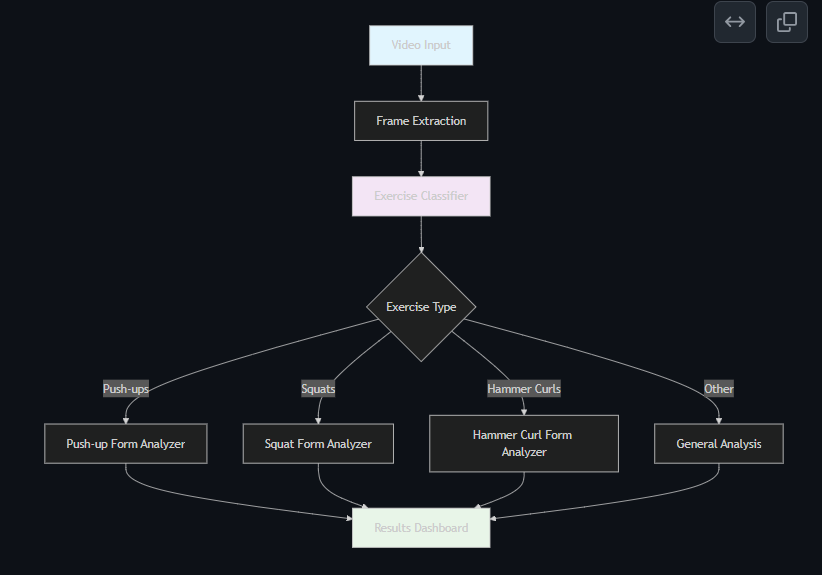
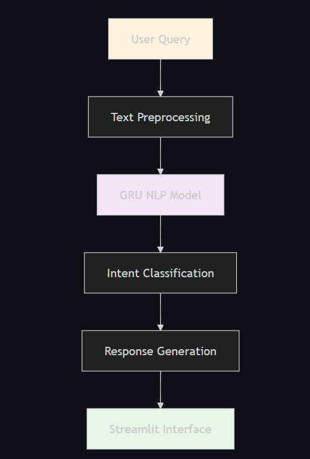

About I-Coach
=============

Overview
--------

I-Coach is a  computer vision application that combines exercise recognition with intelligent form analysis. Built using deep learning models and MediaPipe pose estimation, it provides real-time feedback to help users improve their workout form and technique.

Key Technologies
----------------

**Computer Vision & AI**
- TensorFlow/Keras for deep learning models
- MediaPipe for pose estimation and landmark detection
- OpenCV for video processing and camera handling
- Custom Attention mechanisms for enhanced form analysis

**Web Application**
- Streamlit for interactive web interface
- Real-time video streaming capabilities
- Responsive design with modern UI components

**Natural Language Processing**
- NLTK for text preprocessing
- LSTM-based chatbot for fitness coaching
- Intent recognition and response generation

Architecture
------------

I-Coach uses a multi-model architecture:

1. **Exercise Classification Model**: LSTM-based model trained on pose landmarks
2. **Form Checking Models**: Specialized attention-based models for each exercise

The system processes video frames in real-time, extracts pose landmarks using MediaPipe, and feeds them through the appropriate AI models to provide instant feedback.

3. **Chatbot Model**: NLP model for fitness guidance and Q&A

Use Cases
---------

- **Home Fitness**: Personal workout guidance without a trainer
- **Gym Applications**: Supplement professional training with AI insights
- **Rehabilitation**: Monitor exercise form during physical therapy
- **Fitness Education**: Learn proper exercise techniques through AI feedback

Project Goals
-------------

- Democratize access to professional fitness guidance
- Reduce injury risk through proper form monitoring
- Provide personalized workout feedback
- Make fitness more engaging through AI interaction
