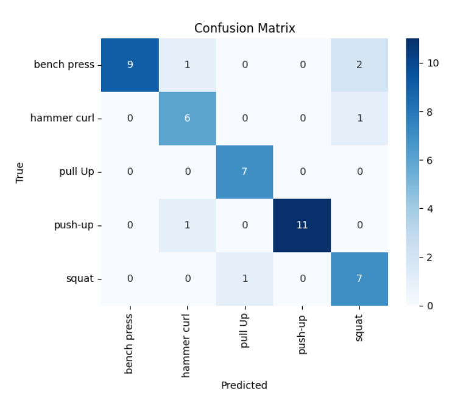
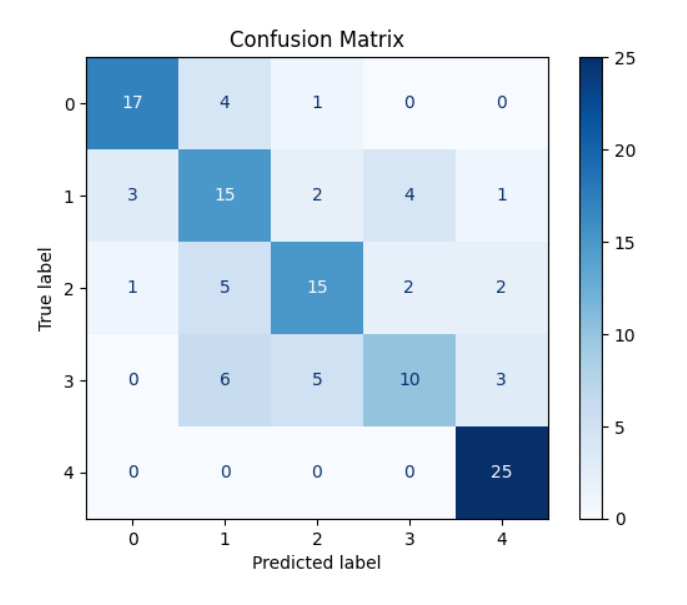
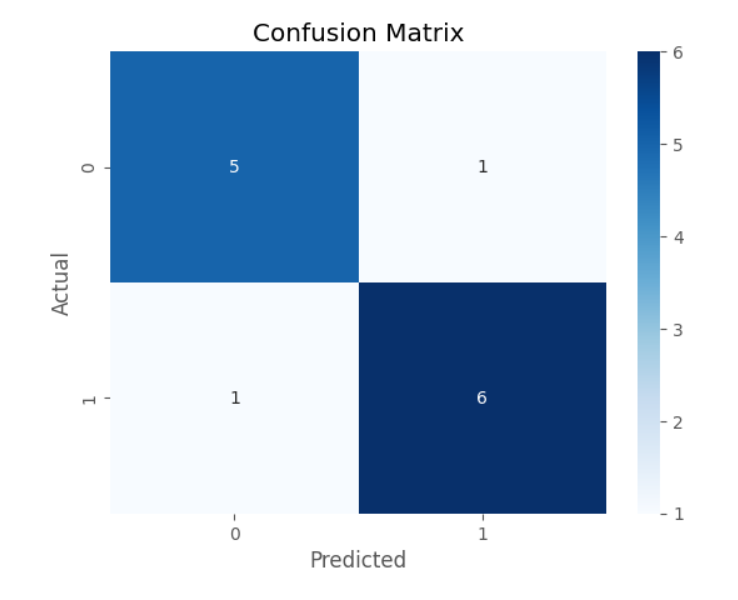

Model Results and Evaluation
============================

This section presents the evaluation results of the models used in the I-Coach system for both exercise classification and form checking tasks.

Exercise Classification Model
-----------------------------

- **Model**: `best_exercise_classifier.h5`
- **Architecture**: GRU
- **Accuracy**: 84%

Form Checking Models
--------------------

**Push-Up Form Checker**

- **Model**: `best_pu_attention_model.h5`
- **Accuracy**: 100%

**Squat Form Checker**

- **Accuracy**: 67.7%

**Hammer Curl Form Checker**

- **Accuracy**: 84.6%

AI Fitness Coach (Chatbot)
--------------------------

- **Architecture**: GRU-based NLP pipeline
- **Training Data**: Custom Q&A fitness dataset
- **Accuracy**: 79%  

